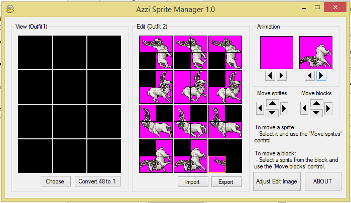

# Azzi Sprite Manager
Da série "coisas que desenvolvi quando participava das comunidade de Open Tibia entre 2007 e 2010"

Esta aplicação auxiliava o criador de OT Server a substituir sprites existentes dentro do Tibia.spr
por outras sprites editadas por ele, ou então criadas por ele, garantindo que estas ocupassem exatamente
a mesma posição, não perdendo a movimentação do monstro e etc.

